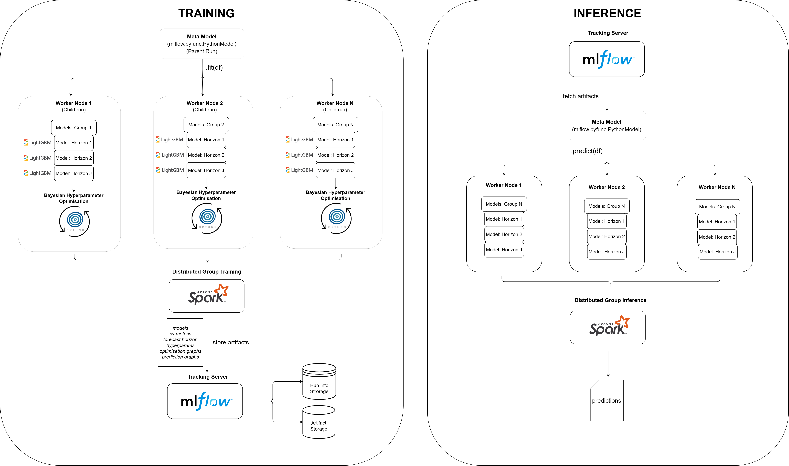

# distributed-ml-forecaster

Distributed ML forecasting model for group based training and inference.

# system design



# usage

```
def hyperparam_space_fn(trial):
    return {
        "n_estimators": trial.suggest_int("n_estimators", 50, 100),
        "learning_rate": trial.suggest_float("learning_rate", 0.01, 0.1),
    }

with mlflow.start_run() as run:
    run_id = run.info.run_id
    model = MetaModel(
        run_id=run_id,
        group_col="cat_id",
        id_cols=["id"],
        date_col="date",
        date_frequency="days",
        n_cv_splits=5,
        max_forecast_horizon=7,
        model_horizon=28,
        target_col="sales",
        tracking_uri="http://127.0.0.1:5000",
        max_hyperparam_evals=30,
        metric="wmape",
        hyperparam_space_fn=hyperparam_space_fn,
    )
    mlflow.pyfunc.log_model(python_model=model, artifact_path="meta_model")
    model.train(df)

model = mlflow.pyfunc.load_model(f"runs:/{run.info.run_id}/meta_model")
model.predict(df).show()
```
