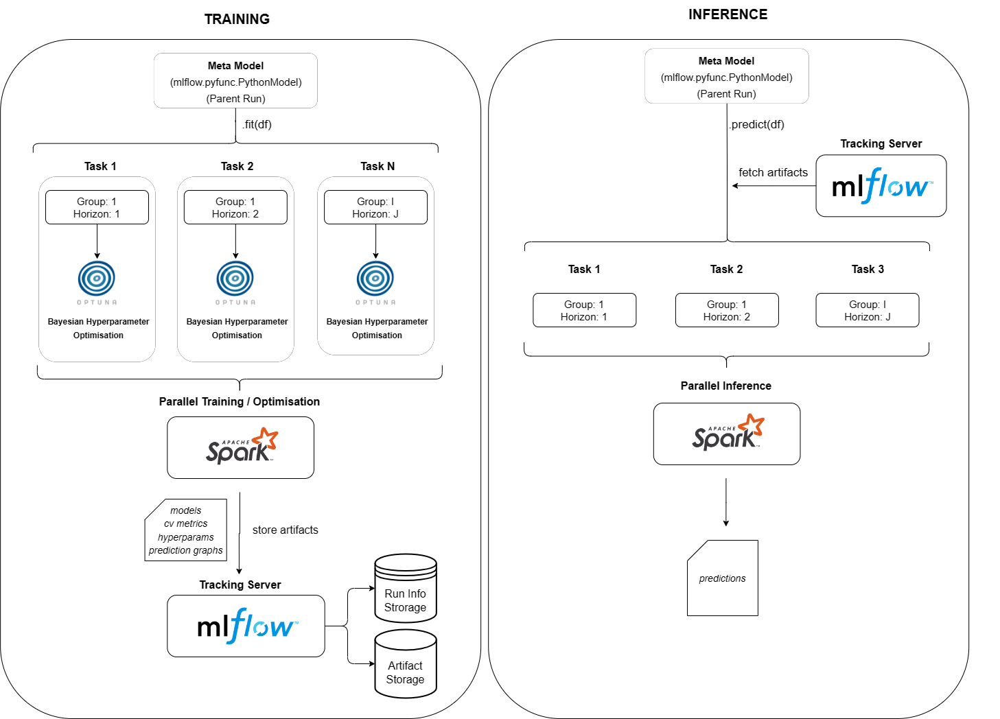

## ForecastFlowML: Scalable Machine Learning Forecasting Framework

ForecastFlowML is a machine learning forecasting framework that integrates MLflow, Spark and Optuna. It provides a scalable solution for time series forecasting tasks by utilizing Spark for distributed model training, Optuna for hyperparameter tuning and MLflow for experiment tracking and model management. With ForecastFlowML, data scientists can streamline their workflow and iterate models faster to improve performance.

## Key Features

- Uses Spark for parallel training of models per group and forecast horizon.
- Integrates MLflow for experiment tracking, artifact management and model registration.
- Includes built-in time based cross validation.
- Incorporates Optuna for hyperparameter tuning and model selection.
- Supports LightGBM algorithm (XGBoost is in progress).

## Installation

You can install the packaging using the following command. Also, ensure that you have installed `spark>=3.0`.

```
pip install "git+https://github.com/canerturkseven/forecastflowml"
```

## Tutorial

ForecastFlowML - Scaleable ML Time Series Forecasting with PySpark and Scikit-learn.


## Usage

The following demonstrates how the framework can be used to build forecasting models using a sample of the Kaggle Walmart M5 Competition dataset.
The sample Databricks notebook can be found [here](https://databricks-prod-cloudfront.cloud.databricks.com/public/4027ec902e239c93eaaa8714f173bcfc/4349737113065041/2597536912577418/4874423725279136/latest.html). You can also run locally using the [script](https://github.com/canerturkseven/ForecastFlowML/blob/master/examples/demo.py).

### Spark

First, initialize the Spark environment. Framework is be able to train as many models in parallel as the number of cores in the cluster. Enable Pyarrow for faster data conversion to Pandas DataFrame. Disable Adaptive Query Execution (AQE) as it may combine smaller model fitting tasks into a single task.

```
from pyspark.sql import SparkSession
spark = (
    SparkSession.builder.master("local[8]")
    .config("spark.driver.memory", "16g")
    .config("spark.sql.execution.arrow.enabled", "true")
    .config('spark.sql.adaptive.enabled', 'false')
    .getOrCreate()
)
```

### Data Setup

| id                   | cat_id  | date       | item_store_window_7_lag_7_mean | item_store_window_7_lag_14_mean | ... | month |
| -------------------- | ------- | ---------- | ------------------------------ | ------------------------------- | --- | ----- |
| FOODS_1_014_CA_1     | FOODS   | 2011-01-29 | 28.4                           | 30.2                            | ... | 1     |
| FOODS_1_014_CA_1     | FOODS   | 2011-01-30 | 8.4                            | 3.2                             | ... | 1     |
| HOBBIES_1_018_CA_1   | HOBBIES | 2011-01-29 | 10.4                           | 23.5                            | ... | 1     |
| HOBBIES_1_018_CA_1   | HOBBIES | 2011-01-30 | 28.4                           | 30.2                            | ... | 1     |
| HOUSEHOLD_1_018_CA_1 | HOBBIES | 2011-01-29 | 2832.4                         | 3042.2                          | ... | 1     |
| HOUSEHOLD_1_018_CA_1 | HOBBIES | 2011-01-30 | 285.4                          | 154.2                           | ... | 1     |
| ...                  | ...     | ...        | ...                            | ...                             | ... | ...   |

Store your data in Spark DataFrame with time series identifier, date and target column with features.
For features, include the lag information with the pattern of `lag_{i}`.
The framework will automatically search for `lag_{i}` regex pattern in columns with model forecast horizon to filter out not allowed lags.

Example 1: `model_horizon=3` and `max_forecast_horizon=6`:

- First model predicts `[1, 2, 3]` steps, hence; `lag_1` and `lag_2` will **NOT** be allowed to use as features.
- Second model predicts `[4, 5, 6]` steps, hence; `lag_1`,`lag_2`,`lag_3`,`lag_4`,`lag_5` will **NOT** be allowed to use as features.

By default, only the maximum lag of forecast horizon will be used for lag features. You can allow for more lag features by changing `feature_lag_range` (default value is 0).

Example 2: If `model_horizon=3`, `max_forecast_horizon=3`, `feature_lag_range=0 (default)`:

- Model predicts `[1, 2, 3]` steps, and only `lag_3` will be allowed to use as feature.

Example 3: If `model_horizon=3`, `max_forecast_horizon=3`, `feature_lag_range=2`:

- Model predicts `[1, 2, 3]` steps, and `lag_3`,`lag_4`,`lag_5` will be allowed to use as feature.

Load sample dataset (Kaggle M5 competition) and examine column names

```
from forecastflowml.data.loader import load_walmart_m5

df_train, df_test = load_walmart_m5(spark)
print(df_train.columns)
```

### Hyperparameter search space

Hyperparameter optimisation is carried out using the Optuna. Define the function for the [search space](https://optuna.readthedocs.io/en/stable/tutorial/10_key_features/002_configurations.html).

```
def hyperparam_space_fn(trial):
    return {
        "learning_rate": trial.suggest_float("learning_rate", 0.05, 0.3),
        "num_leaves": trial.suggest_int("num_leaves", 30, 80),
    }
```

### Model setup

Now instantiate the `MetaModel` object and define parameters.

#### Dataset parameters:

- `group_col`: column to slice the dataframe. Spesific models will be built for each group
- `id_cols`: time series identifer columns.
- `date_col`: date column.
- `target_col`: target column.
- `date_frequency`: date frequency (`days`, `weeks`, `months`, `years`) of the dataframe.

#### Horizon parameters:

- `model_horizon`: horizon per single model.
- `max_forecast_horizon`: total forecast horizon. Must be multiple of `model_horizon`.
- `feature_lag_range`: extra lags to use as features based on forecast horizon.

#### Cross validation and optimisation parameters

- `n_cv_splits`: number of time-based cv splits.
- `cv_step_length`: number of dates between each cv folds.
- `max_hyperparam_evals`: total number of optuna trials.
- `scoring="neg_mean_squared_error`: [sklearn scoring metric](https://scikit-learn.org/stable/modules/model_evaluation.html).
- `hyperparam_space_fn`: optuna hyperparameter space.

#### MLflow server parameter:

- `tracking_uri`: [Mlflow tracking URI](https://mlflow.org/docs/latest/tracking.html). Can be local path (`./mlruns`) or HTTP server (`https://168:0.0.1:5000`).

```
from forecastflowml.meta_model import MetaModel

model = MetaModel(
    # dataset parameters
    group_col="cat_id",
    id_cols=["id"],
    date_col="date",
    target_col="sales",
    date_frequency="days",

    # model parameters
    model_horizon=7,
    max_forecast_horizon=7*4,
    feature_lag_range=2,

    # cross validation and optimisation parameters
    n_cv_splits=1,
    cv_step_length=7*4
    max_hyperparam_evals=1,
    scoring="neg_mean_squared_error",
    hyperparam_space_fn=hyperparam_space_fn,

    # mlflow parameters
    tracking_uri="./mlruns",
)
```

### Training

First, launch MLflow server using the following command for default tracking uri(`./mlruns`). If you selected tracking uri different than default value, see [MLflow tracking options](https://mlflow.org/docs/latest/tracking.html?highlight=server).

```
mlflow ui
```

Call the `fit` method of `MetaModel` object by providing training Spark DataFrame.

```
model.train(df)
```

Now, we can see that the models, metrics and visualisations are being logged to MLflow platform.

### Inference

To obtain the forecast, first load the `MetaModel` as mlflow.pyfunc object.

```
loaded_model = mlflow.pyfunc.load_model(f"runs:/{model.run_id}/meta_model")
```

Then, call the `predict` method with the test Spark DataFrame and call an action like `write` to perform inference.
**Important**: Use actions like `collect` (if the result can fit into the driver) or `write` to touch each partition of the DataFrame.

```
loaded_model.predict(df_test).write.parquet(forecast.parquet)
```

| id                   | date       | prediction |
| -------------------- | ---------- | ---------- |
| FOODS_1_014_CA_1     | 2016-05-23 | 52.4       |
| HOBBIES_1_018_CA_1   | 2016-05-23 | 15.0       |
| HOUSEHOLD_1_018_CA_1 | 2016-05-23 | 254.8      |
| FOODS_1_014_CA_1     | 2016-05-24 | 45.1       |
| HOBBIES_1_018_CA_1   | 2016-05-24 | 30.3       |
| HOUSEHOLD_1_018_CA_1 | 2016-05-24 | 298.4      |
| ...                  | ...        | ...        |

## System design



## Notes

Special thanks to Nikhil Gupta ([@ngupta23](https://github.com/ngupta23)) for his review and precious feedback!
