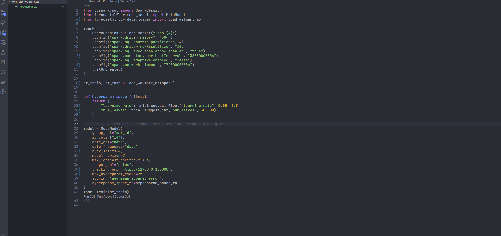

# ForecastMLflow: Scalable Machine Learning Forecasting Framework

ForecastMLFlow is a machine learning forecasting framework that integrates MLflow, Spark and Optuna. It provides a scalable solution for time series forecasting tasks by utilizing Spark for distributed model training, Optuna for hyperparameter tuning and MLflow for experiment tracking and model management. With forecastmlflow, data scientists can streamline their workflow and iterate models faster to improve performance.

# Key Features

- Uses Spark for parallel training of models per group and forecast horizon.
- Integrates MLflow for experiment tracking, artifact management and model registration.
- Includes built-in time based cross validation.
- Incorporates Optuna for hyperparameter tuning and model selection.
- Supports LightGBM and XGBoost algorithms.

# Installation

You can install the packaging using the following command.

```
pip install "git+https://github.com/canerturkseven/forecastmlflow"
```

# Demo

This demo demonstrates how the framework can be used to tackle Kaggle Walmart M5 Competition.

- Build 3 categories (Foods, Households, Hobbies) x 4 weeks (single model per week) = 12 models in parallel.
- Optimize each model with Optuna.
- Perform time based cross validation.
- Examine features, forecast graphs, feature importances and optimisation visualisations on MLflow platform.
- Register meta model and stage to production.



# Usage

```
from forecastmlflow.meta_model import MetaModel
from forecastmlflow.data.loader import load_walmart_m5
from pyspark.sql import SparkSession

# create spark session
spark = (
    SparkSession.builder.master("local[*]")
    .config("spark.driver.memory", "16g")
    .config("spark.sql.execution.arrow.enabled", "true")
    .getOrCreate()
)

# load sample data from forecastmlflow
# examine lag features include pattern of lag_{i}
# model will filter lags (using regex pattern of lag_{i}) based on the model forecast horizon
# example: if model horizon is [1, 2, 3], then lag_1 and lag_2 are allowed to be used
df_train, df_test = load_walmart_m5(spark)

# define optuna hyperparameter space
def hyperparam_space_fn(trial):
    return {
        "n_estimators": trial.suggest_int("n_estimators", 100, 150),
        "learning_rate": trial.suggest_float("learning_rate", 0.2, 0.3),
    }

# initialize model
model = MetaModel(
    group_col="cat_id",  # column to slice dataframe
    id_cols=["id"],  # columns to use as time series identifier
    date_col="date",  # date column
    date_frequency="days",  # date frequency of dataset
    n_cv_splits=4,  # number of time-based cv splits
    max_forecast_horizon=28,  # total forecast horizon
    model_horizon=7,  # horizon per model
    target_col="sales",  # target column
    tracking_uri="./mlruns",  # Mlflow tracking URI can be local or remote
    max_hyperparam_evals=100,  # total number of optuna trials
    scoring="neg_mean_squared_error",  # sklearn scoring metric
    hyperparam_space_fn=hyperparam_space_fn,  # optuna hyperparameter space
)

# train model
model.train(df)

# load model
model = mlflow.pyfunc.load_model("runs:/d6962cbc77b24336895fb4a7b42c02e5/meta_model")

# predict
model.predict(df_test).write.parquet(forecast.parquet)
```

# System design


